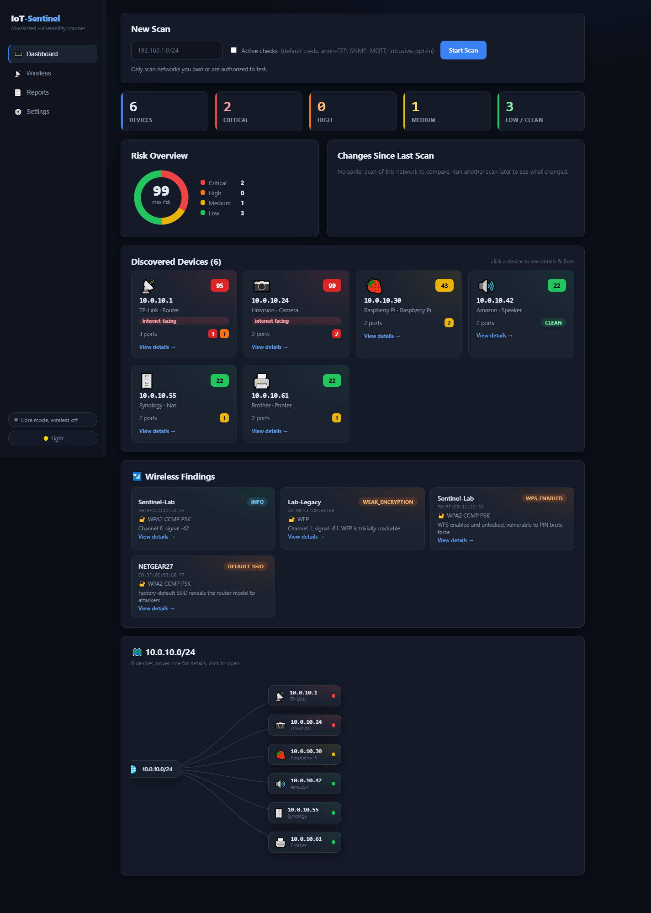
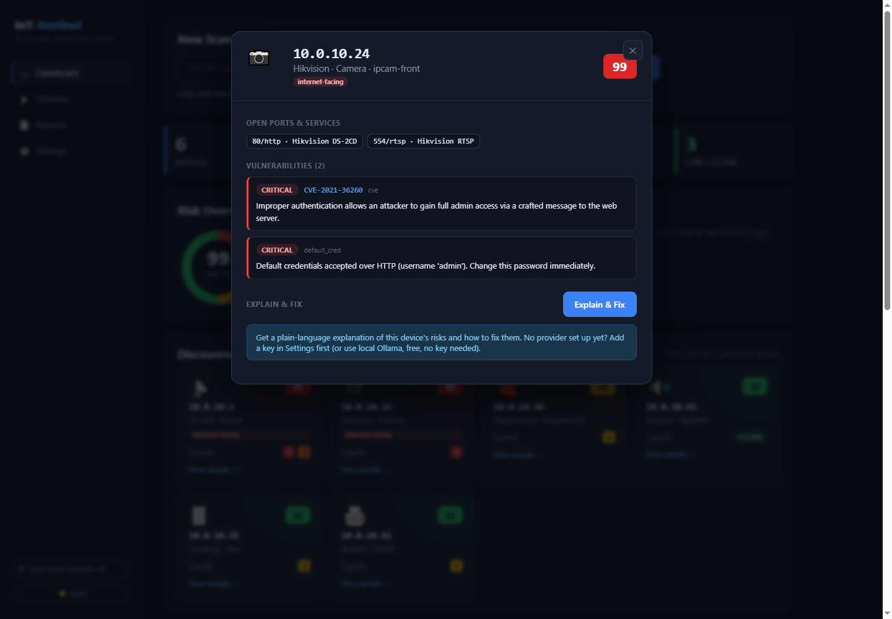
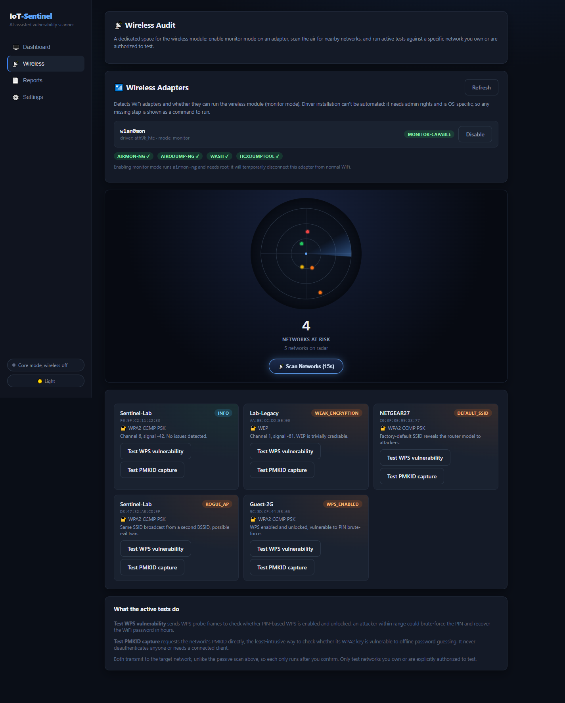
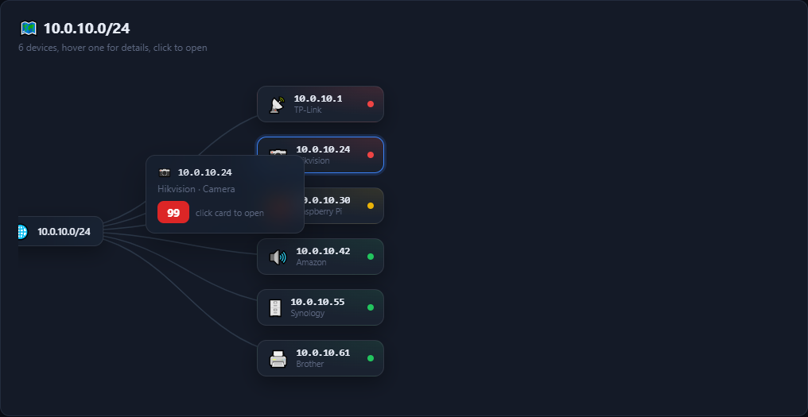
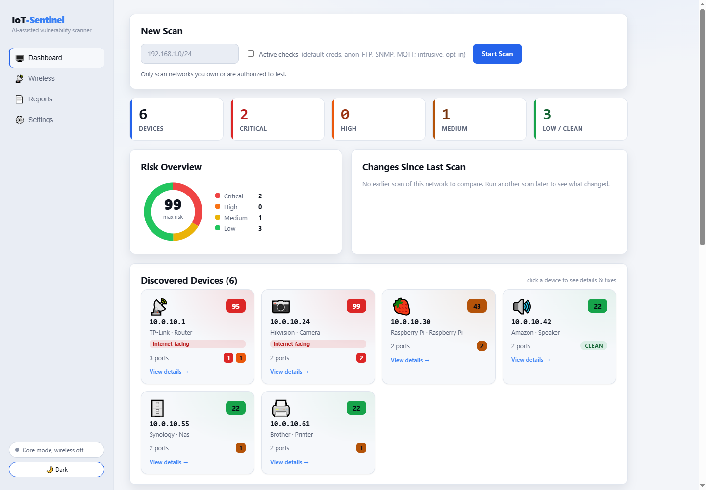

<div align="center">

# 🛡️ IoT-Sentinel

### AI-Assisted IoT Vulnerability &amp; Exposure Scanner

Find the vulnerable devices on your network, understand why they matter,<br/>
and get told exactly how to fix them in plain language.


<br/><br/>



</div>

---

IoT-Sentinel scans a network for IoT devices, correlates what it finds against known
vulnerability data, checks internet exposure and default credentials, optionally audits
the surrounding WiFi, and uses an AI layer to turn raw findings into a plain-language,
prioritized risk report for people who aren't security engineers.

It **does not reinvent scanning technology**. It orchestrates proven tools (`nmap`,
`aircrack-ng`, NVD's CVE database) and adds the layer that's missing in the open-source
space: correlation across data sources, IoT-specific risk scoring, and human-readable
reporting. The sort of thing Nessus or Nozomi do, but free and IoT-focused for NGOs,
schools, and home users.

## Screenshots

> All screenshots use a fictional sample network. No real device data is shown.

<table>
<tr>
<td width="50%" valign="top">

**Device detail: what's wrong and how to fix it**



Every device opens into its open ports, matched CVEs, and severity-ranked findings, with a
one-click plain-language explanation and remediation steps.

</td>
<td width="50%" valign="top">

**Wireless audit with live radar**



Monitor-mode adapter detection, passive network discovery, and gated active tests for WPS
and PMKID exposure. Weak encryption, rogue APs, and factory-default SSIDs are flagged.

</td>
</tr>
<tr>
<td width="50%" valign="top">

**Network map with hover preview**



The scanned subnet as a hierarchy. Hover any node for a live preview, click to open the
full device report.

</td>
<td width="50%" valign="top">

**Light and dark themes**



The whole dashboard is theme-aware and follows your system preference, with a manual
override in the sidebar.

</td>
</tr>
</table>

## Legal &amp; ethics notice

> This tool is for auditing networks and devices you own or have explicit written
> authorization to test. Passive wireless sniffing and active vulnerability scanning of
> networks you do not control may violate local law regardless of intent. The author
> assumes no liability for misuse.

Active techniques (default-credential testing, deauth detection) are **opt-in and gated**.
The app binds to localhost by default and sends scan data nowhere except NVD (CVE lookups)
and whichever AI provider you configure — or nowhere at all if you use local Ollama.

## Capability status

Honest breakdown of what's built, partial, or planned — verified against the code.

### ✅ Implemented & working

| Capability | Notes |
|---|---|
| Device discovery (ARP scan) | Scapy; any network adapter, incl. USB WiFi |
| Port scan + banner grabbing | nmap service/version detection |
| mDNS / UPnP / SSDP discovery | Merges SSDP hosts ARP misses |
| Vendor fingerprinting (IEEE OUI, ~30k vendors) | Full scapy OUI database + built-in fallback |
| Device-type inference | Vendor + hostname + open-port signatures (printer/camera/PC/router/…) |
| CVE cross-referencing (NVD) | Matches on product+version, filters noise, dedups, weekly cache |
| **CISA KEV enrichment** | Flags CVEs that are actively exploited in the wild (free CISA catalog, weekly cache) |
| Rule-based vulnerability detection | Offline engine: insecure/cleartext services (Telnet, FTP, SMB, RDP, SNMP, RTSP, MQTT, Modbus…), unencrypted mgmt, internet-exposed services, attack surface |
| **Active probes** (opt-in) | Anonymous-FTP login, SNMP default community, open-MQTT broker checks |
| **TLS / certificate checks** | Self-signed / expired certs, legacy TLS 1.0/1.1 on HTTPS services |
| **Scan diffing + trends** | New/removed devices and risk changes vs the previous scan of the same subnet |
| **Internet-exposure detection** | Flags gateway + UPnP-forwarded devices |
| Risk scoring engine (0–100) | Exposure + CVE severity + creds + WiFi encryption |
| Default-credential check | Advisory by default; **real, opt-in HTTP Basic-Auth probe** when enabled |
| AI risk reports | Claude / OpenAI / Gemini / Groq / Ollama, de-identified |
| **Printable HTML report export** | Works offline; print-to-PDF ready |
| Async scans with live progress | Non-blocking; dashboard polls status |
| Web dashboard | Summary tiles, risk table, network map, wireless panel |
| Wireless module *(code complete)* | Passive capture, scapy deauth detection, WPS check |
| **Adapter setup panel** | Lists WiFi adapters + monitor-mode capability; one-click enable monitor mode (Linux); install guidance |

### 🟡 Partial / environment-gated

| Capability | Limitation |
|---|---|
| Wireless auditing | Code is complete and tested, but **runs only on Linux with a monitor-mode adapter** (see below). No such adapter → the module reports itself unavailable and the app runs Core-only. |
| Default-cred testing | Real probe covers **HTTP/HTTPS Basic-Auth** only; telnet/ssh/ftp remain advisory. |
| CVE matching | Keyword+version match against NVD, not full CPE resolution — good signal, not exhaustive. |

### ⬜ Planned

- OS keychain integration for API keys
- Native `.exe` packaging (PyInstaller)
- Firmware / EOL version checking

## Does my WiFi adapter work?

- **Finding devices (Core scan):** any adapter that connects you to the network works —
  including a USB WiFi dongle or built-in WiFi. Discovery is software; the adapter is just
  your connection.
- **Wireless auditing (monitor mode):** needs an adapter whose chipset supports **monitor
  mode + packet injection** (e.g. Atheros AR9271, Ralink RT3070, some Realtek). Many common
  USB adapters don't. The app auto-detects this at startup (`GET /api/wireless/status`) and
  simply disables the wireless module if unsupported.

## Architecture

```
Web Dashboard (React) ──REST──> FastAPI Backend
                                  ├── Core Scan Engine (Scapy ARP, nmap, mDNS/UPnP/SSDP, OUI, exposure)
                                  ├── Correlation Engine (NVD CVE, default-cred, risk scoring)
                                  ├── Wireless Module (airodump-ng / scapy / wash — Linux only)
                                  ├── SQLite Database (shared schema)
                                  └── AI Report Layer (pluggable providers → HTML/PDF export)
```

Scans run in a background thread; the API returns immediately and the dashboard polls
progress. Every module writes the same SQLite schema, so Core (your everyday machine) and
Wireless (a Kali VM) can share one backend/DB.

## Setup

### Option A — Docker (Core, recommended)

```bash
git clone https://github.com/<you>/iot-sentinel.git
cd iot-sentinel
cp .env.example .env
docker compose up --build core
```

API on `http://localhost:8000`. Run the frontend separately (below).

### Option B — Native Python

```bash
cd backend
python -m venv venv
venv\Scripts\activate          # Windows  (source venv/bin/activate on Linux/macOS)
pip install -r requirements.txt
uvicorn main:app --reload
```

Requires `nmap` installed separately ([nmap.org/download](https://nmap.org/download.html);
the Windows installer includes Npcap, needed for scanning). Without nmap, discovery still
runs but port scans are skipped.

### Frontend

```bash
cd frontend
npm install
npm run dev        # dev server on :3000, proxies /api to :8000
```

Open `http://localhost:3000`, enter your subnet (e.g. `192.168.1.0/24`), and start a scan.

### Wireless module (Linux only)

```bash
# Requires a monitor-mode-capable USB adapter (e.g. Atheros AR9271, Ralink RT3070).
sudo apt install aircrack-ng -y
sudo airmon-ng start wlan0

python -m wireless.cli --interface wlan0mon --duration 30 \
    --api-endpoint http://<core-host>:8000 --scan-id <id> \
    [--deauth <BSSID>] [--wps <BSSID>]
```

## Configuring the AI provider

Dashboard → **Settings** → pick a provider → paste the key → **Save**. No restart. Keys are
encrypted at rest (Fernet) and never returned in full or logged. For a free, fully-local
option: `ollama pull llama3:8b && ollama serve`, then select **Ollama** — no key, nothing
leaves your machine.

The **printable HTML report** works with no provider at all.

## API overview

```
GET    /api/health
POST   /api/scans                      { subnet, test_creds? }
GET    /api/scans                      list scans (with status/progress)
GET    /api/scans/{id}                 scan + devices + findings
GET    /api/scans/{id}/report          AI-generated risk report
GET    /api/scans/{id}/report.html     standalone printable report (?ai=true to include AI narrative)
POST   /api/scans/{id}/wireless        ingest wireless findings
GET    /api/wireless/status            wireless module availability
GET/POST/DELETE /api/settings/ai-provider
```

Interactive docs at `/docs` (disabled when `IOT_PRODUCTION=true`).

## Testing

```bash
cd backend
pip install -r requirements-dev.txt
python -m pytest -q          # offline: risk scoring, CVE parse/filter, creds, wireless parse, de-identification
```

## Security posture

- Scan data stays local; nothing leaves the machine except CVE lookups to NVD and the AI
  provider you configured.
- Data sent to AI providers is **de-identified** (raw MACs and full internal IPs stripped).
- API keys encrypted at rest; managed only via the UI; stripped from logs and error bodies.
- Backend binds to `127.0.0.1` by default; `IOT_PRODUCTION=true` enforces localhost-only and
  disables auto-docs.
- All SQL parameterized; all subprocess calls use argument lists (never `shell=True`).

**Honest threat model:** encryption at rest protects against accidental exposure (git leaks,
shared files, casual DB access). It does **not** protect against an attacker who already has
full access to the machine running the tool.

## Development note

This project is heavily AI-assisted — treat AI-generated code as untrusted first drafts. Run
`bandit`, `pip-audit`, and `gitleaks` before releases, and review every `subprocess`, SQL,
and file-I/O path by hand.

## License

MIT — see [LICENSE](LICENSE). Provided as-is; the author assumes no liability for misuse.
